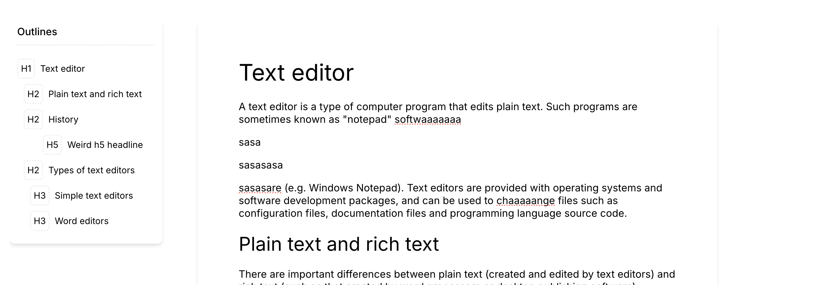

# Anchor Heading

A tiptap extension to allow anchor your headings,and make it easy to create outlines.

Features:

- Scroll/Focus to anchor
- Unique anchor

  

```ts
AnchorHeading.configure({
  // heading levels allowed
  levels: [1, 2, 3],
  onAnchorUpdate(anchorIds) {
    // runs and gives you list of anchorIds, 
    // whenever there is any update made to anchors
  }
})
```
